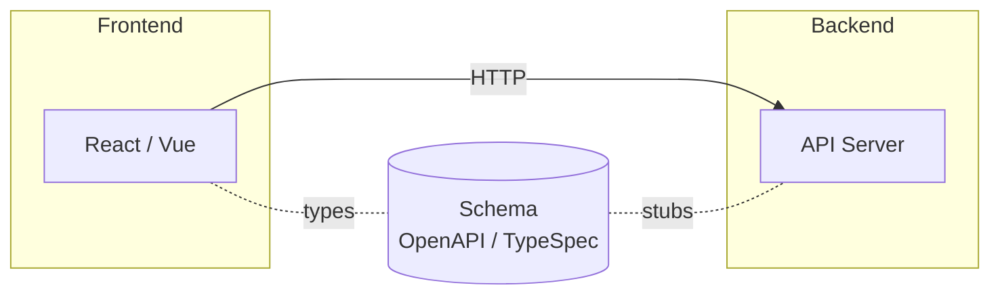
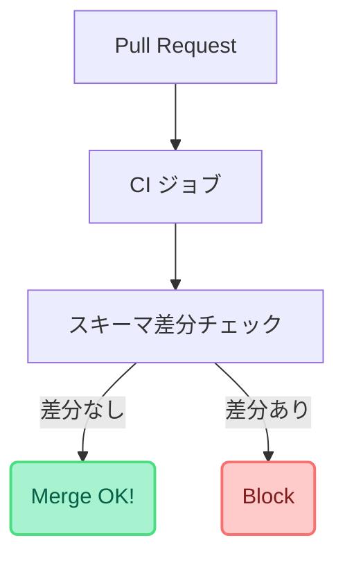

> **この記事の対象読者**: フロントエンド／バックエンド開発者、技術選定に関わるリード／アーキテクト、生成AIを開発ワークフローに組み込みたいエンジニア。  
> **この記事でわかること**: スキーマ駆動開発（Schema‑Driven Development: SDD）の基本、OpenAPIからTypeSpecへの進化、Zodを活用した型安全フロントエンド、AI活用時のコンテキスト削減戦略、CI/CDで契約（Contract）を壊さない仕組み。

## 1. はじめに：なぜ “AI × スキーマ駆動開発” なのか

生成AI（LLM）を開発に取り入れてみたものの、「プロンプトで説明した仕様」と「実際の実装」がズレてしまうことはありませんか？  
2025年現在、生成AIは **一度の指示で完璧にコードを出力するより、複数回の対話で目的地に近づく** 方向に進化しています。  
曖昧な自然言語より **機械にも人間にも解釈が一意な “スキーマ”** をハブとして共有すると、AI との協調開発でもズレを抑えられます。

## 2. スキーマ駆動開発とは

**スキーマ駆動開発（Schema‑Driven Development / Contract‑First / Spec‑First）** とは、コードより先に API・イベント・データモデルなどの仕様を “スキーマ” として定義し、それを *ソース・オブ・トゥルース* として実装・テスト・ドキュメンテーションを派生生成していく開発スタイルです。

下記の矢印はAPIコールを示し、点線部分はそれぞれtypesとstubsを生成できることを示しています。



### 2.1 スキーマ駆動開発で扱う主なアーティファクト

| 活用先         | 自動生成できるもの                                     | 期待効果                    |
| -------------- | ------------------------------------------------------ | --------------------------- |
| フロントエンド | 型定義 / API クライアント / モック                     | 実装の早期開始・型安全化    |
| バックエンド   | サーバースタブ / ルーティング雛形 / 入力バリデーション | 一貫した契約遵守・漏れ検出  |
| QA/テスト      | 契約テスト / スキーマベーステストケース                | 正常系/異常系の抜け漏れ削減 |
| ドキュメント   | API リファレンス / ER 図                               | 更新コスト削減              |

---

## 3. OpenAPI の功績と限界

OpenAPI（旧 Swagger）は REST API の事実上の標準仕様として広く普及し、ツール連携（コード生成・モック・UIドキュメント）が充実しています。
ただしプロジェクトが大規模になると次の課題が顕在化します。

* YAML/JSON が冗長で DRY に保ちづらい
* 型再利用やテンプレート化が複雑
* モジュール分割・合成戦略がプロダクト／ツール依存

そこで登場するのが **TypeSpec** です。TypeScript ライクな宣言型 DSL で、**再利用性・テンプレート性・モジュール化** が高く、OpenAPI へのエクスポートも可能です。

参考: 

- [TypeSpec の概要 (Microsoft Learn)](https://learn.microsoft.com/en-us/azure/developer/typespec/overview)
- [TypeSpec が OpenAPI や JSON Schema を書くのに良かったので紹介する](https://zenn.dev/kimuson/articles/typespec_openapi)

### TypeSpecの例

以下に、**TODO** という単一リソースに対する CRUD をそれぞれ **OpenAPI 3.1** と **TypeSpec** で記述したサンプルを示します。

記述量の差とわかりやすさに注目してみてください。

### 1. OpenAPI 3.1 仕様例（YAML）

```yaml
openapi: 3.1.0
info:
  title: Todo API
  version: "1.0.0"
servers:
  - url: https://api.example.com
paths:
  /todos:
    get:
      summary: Todo一覧を取得
      operationId: listTodos
      responses:
        "200":
          description: 一覧取得成功
          content:
            application/json:
              schema:
                type: array
                items:
                  $ref: "#/components/schemas/Todo"
    post:
      summary: Todoを新規作成
      operationId: createTodo
      requestBody:
        required: true
        content:
          application/json:
            schema:
              $ref: "#/components/schemas/CreateTodo"
      responses:
        "201":
          description: 作成成功
          content:
            application/json:
              schema:
                $ref: "#/components/schemas/Todo"

  /todos/{id}:
    parameters:
      - name: id
        in: path
        required: true
        schema:
          type: string
    get:
      summary: Todoを取得
      operationId: getTodo
      responses:
        "200":
          description: 取得成功
          content:
            application/json:
              schema:
                $ref: "#/components/schemas/Todo"
        "404":
          description: 見つからない
    put:
      summary: Todoを更新
      operationId: updateTodo
      requestBody:
        required: true
        content:
          application/json:
            schema:
              $ref: "#/components/schemas/UpdateTodo"
      responses:
        "200":
          description: 更新成功
          content:
            application/json:
              schema:
                $ref: "#/components/schemas/Todo"
    delete:
      summary: Todoを削除
      operationId: deleteTodo
      responses:
        "204":
          description: 削除成功（内容なし）

components:
  schemas:
    Todo:
      type: object
      required: [id, title, completed, createdAt]
      properties:
        id:
          type: string
          format: uuid
        title:
          type: string
          maxLength: 255
        completed:
          type: boolean
        createdAt:
          type: string
          format: date-time

    CreateTodo:
      type: object
      required: [title]
      properties:
        title:
          type: string
          maxLength: 255
        completed:
          type: boolean
          default: false

    UpdateTodo:
      type: object
      properties:
        title:
          type: string
          maxLength: 255
        completed:
          type: boolean
```

---

### 2. TypeSpec 仕様例（`.tsp`）

```tsp
import "@typespec/rest"; // HTTP ライブラリを読み込み

@service({ title: "Todo API", version: "1.0.0" })
namespace TodoApi;

/*------------------------------
 *  モデル定義
 *-----------------------------*/
model Todo {
  id: string;
  title: string;
  completed: boolean;
  createdAt: utcDateTime;
}

model CreateTodo {
  title: string;
  completed?: boolean;
}

model UpdateTodo {
  title?: string;
  completed?: boolean;
}

/*------------------------------
 *  エンドポイント
 *-----------------------------*/
@route("/todos")
interface Todos {
  @get list(): Todo[];

  @post create(@body CreateTodo): Todo;
}

@route("/todos/{id}")
interface TodoItem {
  @get read(@path id: string): Todo;

  @put update(@path id: string, @body UpdateTodo): Todo;

  @delete delete(@path id: string): void;
}
```

## 4. AI 開発におけるコンテキスト削減の重要性

LLM に仕様を伝える際、自然言語で長々説明するとトークンコストも曖昧さも増えます。
**スキーマをプロンプトに直接差し込めば**、トークン数を削減しつつ構造化された「正規の仕様」を共有できます。

## 5. フロントエンド編：Zod による型安全 & バリデーション

### 5.1 最小 Zod 例

```ts
import { z } from "zod";

const UserSchema = z.object({
  id: z.string().uuid(),
  name: z.string().min(1),
  age: z.number().int().nonnegative().optional(),
});

type User = z.infer<typeof UserSchema>;

async function fetchUser(id: string): Promise<User> {
  const res = await fetch(`/api/users/${id}`);
  const data = await res.json();
  return UserSchema.parse(data); // 不整合なら例外
}
```

### 5.2 OpenAPI / TypeSpec から Zod スキーマを生成する

手書き Zod もよいですが、**仕様 → 自動生成 → 型＆ランタイム検証同時反映** が SDD の真骨頂です。
利用ツール例:

* `openapi-zod-client`
* `zod-openapi`（スキーマ相互変換）
* 内製スクリプト: TypeSpec → OpenAPI → Zod 型生成

---

## 6. CI/CD 編：契約を壊さないパイプライン

> ❗ **ポイント**: スキーマが “真実” である以上、ズレれば全レイヤーが破綻します。CI/CD で自動チェックし、壊れた PR を止める仕組みが不可欠です。

### 6.1 パイプライン全体像

1. **PR でスキーマ差分を検出**
2. **コード生成を再実行し差分比較**（フロント型 / サーバースタブ）
3. **契約テスト**（実装 vs スキーマ ／ モックサーバー）
4. **ブレイキングチェンジ検知**（必須化・型削除・互換性破壊）



---

## 7. まとめ：AI 時代の開発者マインドセット

スキーマ駆動開発は **“合意形成コストの前払い”** が必要ですが、マルチチーム・マルチクライアント環境では効果が指数的に高まります。
生成AIと組み合わせることで、**「人間が守るべき契約」を「AI が支援する継続的システム」** として回せるようになります。

## Zod + React Query 実装スケルトン

```ts
import { z } from "zod";
import { useQuery } from "@tanstack/react-query";

const UserSchema = z.object({
  id: z.string().uuid(),
  name: z.string(),
  email: z.string().email(),
});

type User = z.infer<typeof UserSchema>;

async function fetchUser(id: string): Promise<User> {
  const res = await fetch(`/api/users/${id}`);
  const data = await res.json();
  return UserSchema.parse(data);
}

export function useUser(id: string) {
  return useQuery({
    queryKey: ["user", id],
    queryFn: () => fetchUser(id),
  });
}
```

## おわりに

スキーマ駆動開発は **AI 補助・自動生成・契約保証・型安全** を同時に享受できるモダン開発手法です。TypeSpec や Zod などのツールが成熟した今、小さなモジュールから導入してみてはいかがでしょうか。

